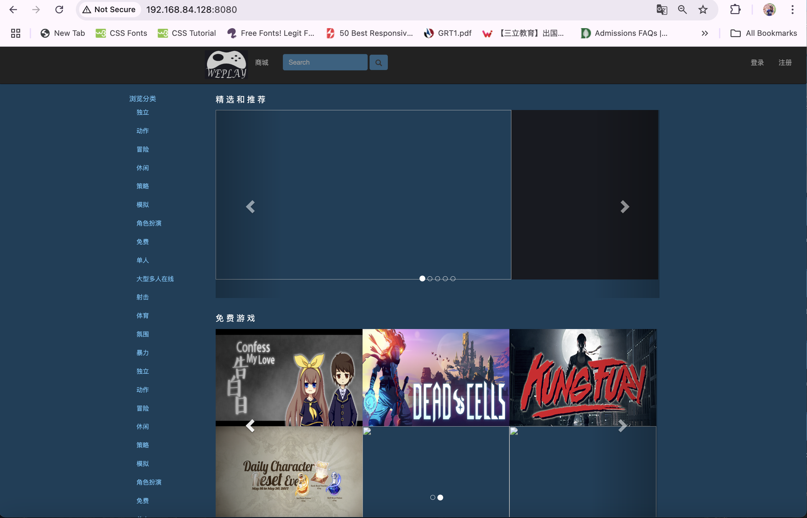
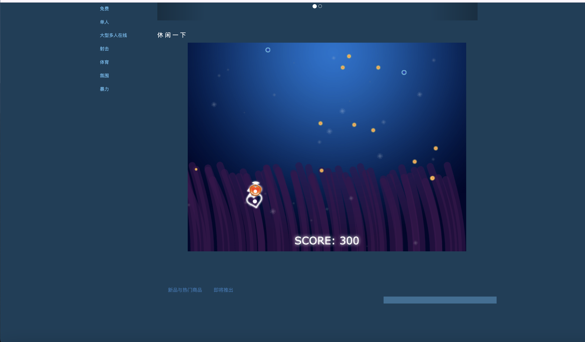

# WePlay Game Store

A web-based game store platform built with Java Spring MVC, offering a seamless gaming experience with features like user authentication, game browsing, shopping cart, and secure payment processing.

## Features

- User Authentication & Authorization
  - User registration with email verification
  - Secure login system
  - Password recovery functionality
  - Personal profile management

- Game Management
  - Browse games by categories and tags
  - Detailed game information pages
  - Game search functionality
  - Featured and recommended games

- Shopping Experience
  - Shopping cart functionality
  - Secure payment processing
  - Order history and tracking
  - Multiple payment methods support

- User Interface
  - Responsive design
  - Modern and intuitive layout
  - Multi-language support
  - User-friendly navigation
 
## Sneak Peek
Homepage - The homepage displays featured games, categories, and navigation options.


FishGame - Users can play the Fish Game directly on the homepage without needing to download or install anything.



## Technology Stack

- Backend: Java Spring MVC
- Frontend: JSP, HTML5, CSS3, JavaScript
- Database: MySQL
- Build Tool: Maven
- Server: Apache Tomcat

## Prerequisites

- JDK 8 or higher
- Maven 3.x
- MySQL 5.7 or higher
- Apache Tomcat 8.x or higher

## Installation

1. Clone the repository:
```bash
git clone https://github.com/cicichang11/weplay-digital-media-trading-platform.git
```

2. Configure the database:
   - Create a MySQL database
   - Update the database configuration in `src/main/resources/application.properties`

3. Build the project:
```bash
mvn clean package
```

4. Deploy the WAR file to Tomcat:
   - Copy the generated WAR file from `target/` to Tomcat's `webapps/` directory
   - Start Tomcat server

## Configuration

The application can be configured through the following files:
- `src/main/resources/application.properties` - Database and application settings
- `src/main/webapp/WEB-INF/web.xml` - Web application configuration

## Contributing

1. Fork the repository
2. Create your feature branch (`git checkout -b feature/AmazingFeature`)
3. Commit your changes (`git commit -m 'Add some AmazingFeature'`)
4. Push to the branch (`git push origin feature/AmazingFeature`)
5. Open a Pull Request

## License

This project is licensed under the MIT License - see the [LICENSE](LICENSE) file for details.

## Acknowledgments

- Spring Framework
- Bootstrap
- jQuery
- All contributors who have helped with this project 
